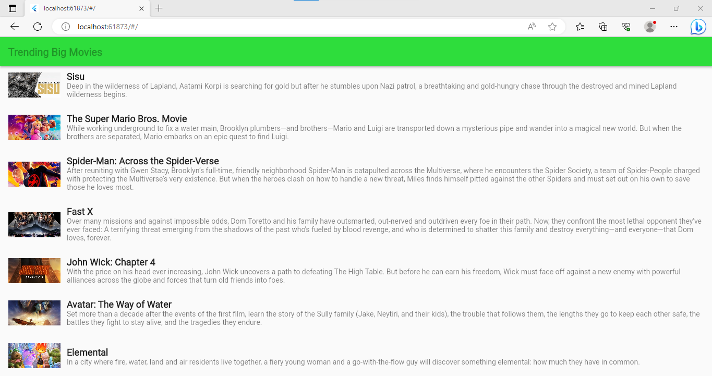

# UAS-PemrogramanMobile

| Nama      | Dimas Riyadh Alfajri |
| ----------- | ----------- |
| NIM     | 312010029       |
| Kelas   | TI.20.A.1        |
| Matkul     | Pemrograman Mobile  |

## Flutter API
Berikut project UAS Pemrograman Mobile yang menggabungkan penggunaan API dengan Flutter untuk membuat aplikasi mobile. Dalam project ini, saya akan menggunakan Flutter untuk menampilkan data dari API yang tersedia.

Pastikan Anda telah menginstal Flutter SDK. Jika belum, Anda dapat mengunjungi `flutter.dev` dan
API yang saya gunakan adalah `https://www.themoviedb.org/movie`

## Output nya

